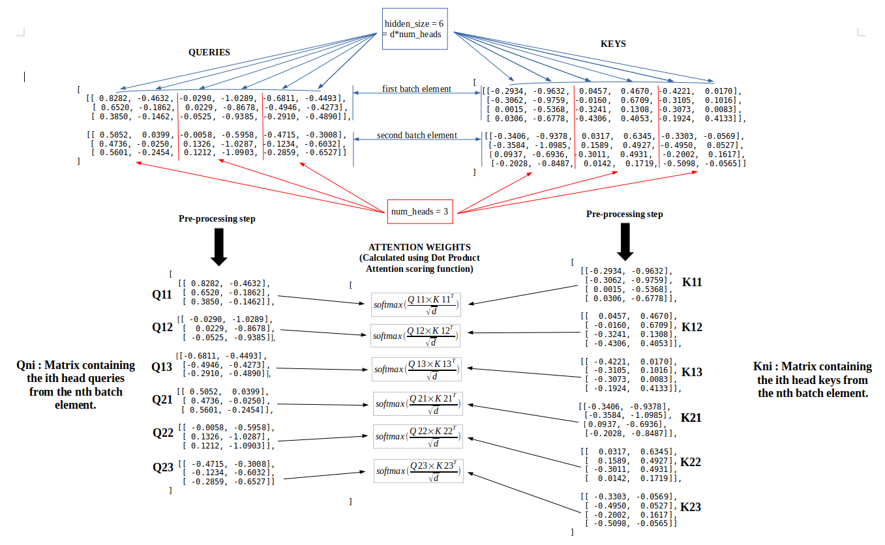
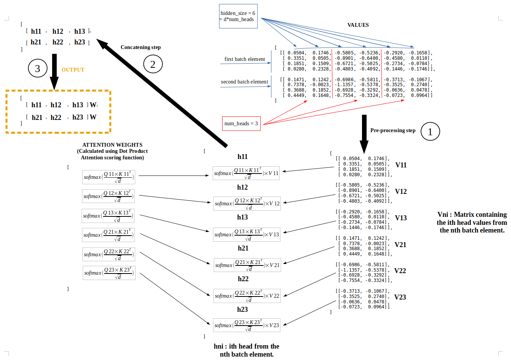

```python
import torch
import torch.nn as nn
```

***
### MULTI-HEAD ATTENTION WITH DOT PRODUCT ATTENTION SCORING FUNCTION
***

### *High-level overview through an example*


```python
batch_size = 2;

number_of_queries = 3;
query_dimension = 4;

number_of_keys_values = 4;
key_dimension = 3;
value_dimension = 2;

## INPUTS ##

# This is the kind of inputs that Multi-Head Attention could take:
queries = torch.rand(batch_size, number_of_queries, query_dimension);
keys = torch.rand(batch_size, number_of_keys_values, key_dimension);
values = torch.rand(batch_size, number_of_keys_values, value_dimension);

## LINEAR TRANSFORMATIONS ##

# The first step in Multi-Head Attention is to:
# - Transform each query by a linear transformation Wq.
# - Transform each key by a linear transformation Wk.
# - Transform each value by a linear transformation Wv.

# So that each linear transformation projects the different 
# queries, keys and values in the same vector space of hidden_size dimension.

hidden_size = 6;

Wq = nn.Linear(query_dimension, hidden_size);
Wk = nn.Linear(key_dimension, hidden_size);
Wv = nn.Linear(value_dimension, hidden_size);

# queries.shape = (batch_size, number_of_queries, hidden_size);
queries = Wq(queries);
print("queries.shape => ", queries.shape);

# keys.shape = (batch_size, number_of_keys_values, hidden_size);
keys = Wk(keys);
print("keys.shape => ", keys.shape);

# values.shape = (batch_size, number_of_keys_values, hidden_size);
values = Wv(values);
print("values.shape => ", values.shape);
```

    queries.shape =>  torch.Size([2, 3, 6])
    keys.shape =>  torch.Size([2, 4, 6])
    values.shape =>  torch.Size([2, 4, 6])


***

The next step is a pre-processing step which consists in splitting 
each vector into several parts or "*heads*", **num_heads** is the parameter which determines the number of heads (it is thus necessary that *hidden_size is a multiple of num_heads*).

After that the first head of each query of the nth element of the batch will interact with the first head of each key of the nth element of the batch, the second head of each query of the nth element of the batch will interact with the second head of each key of the nth element of the batch, etc... 

So that n goes from 1 to batch_size.

An image will help to understand better.


```python
queries
```


    tensor([[[ 0.8282, -0.4632, -0.0290, -1.0289, -0.6811, -0.4493],
             [ 0.6520, -0.1862,  0.0229, -0.8678, -0.4946, -0.4273],
             [ 0.3850, -0.1462, -0.0525, -0.9385, -0.2910, -0.4890]],
    
            [[ 0.5052,  0.0399, -0.0058, -0.5958, -0.4715, -0.3008],
             [ 0.4736, -0.0250,  0.1326, -1.0287, -0.1234, -0.6032],
             [ 0.5601, -0.2454,  0.1212, -1.0903, -0.2859, -0.6527]]],
           grad_fn=<AddBackward0>)


```python
keys
```


    tensor([[[-0.2934, -0.9632,  0.0457,  0.4670, -0.4221,  0.0170],
             [-0.3062, -0.9759, -0.0160,  0.6709, -0.3105,  0.1016],
             [ 0.0015, -0.5368, -0.3241,  0.1308, -0.3073,  0.0083],
             [ 0.0306, -0.6778, -0.4306,  0.4053, -0.1924,  0.4133]],
    
            [[-0.3406, -0.9378,  0.0317,  0.6345, -0.3303, -0.0569],
             [-0.3584, -1.0985,  0.1589,  0.4927, -0.4950,  0.0527],
             [-0.0937, -0.6936, -0.3011,  0.4931, -0.2002,  0.1617],
             [-0.2028, -0.8487,  0.0142,  0.1719, -0.5098, -0.0565]]],
           grad_fn=<AddBackward0>)


```python
values
```


    tensor([[[ 0.0504,  0.1746, -0.5805, -0.5236, -0.2920, -0.1658],
             [ 0.3351,  0.0505, -0.8901, -0.6400, -0.4580,  0.0110],
             [ 0.1851,  0.1509, -0.6721, -0.5025, -0.2734, -0.0784],
             [ 0.0280,  0.2328, -0.4803, -0.4092, -0.1446, -0.1746]],
    
            [[ 0.1471,  0.1242, -0.6986, -0.5811, -0.3713, -0.1067],
             [ 0.7378, -0.0023, -1.1357, -0.5378, -0.3525,  0.2740],
             [ 0.3688,  0.1852, -0.6928, -0.3292, -0.0636,  0.0478],
             [ 0.4449,  0.1648, -0.7554, -0.3324, -0.0723,  0.0964]]],
           grad_fn=<AddBackward0>)




***

After this interaction between the queries and the keys which gives the attention weights, comes now the interaction between these attention weights and the values (which will have undergone the same transformation as the queries and the keys) in the same way as between the queries and the keys, the nth block of attention weights will interact with the nth block of values.

This last interaction will give rise to the different "heads" that will only need to be concatenated before producing the final output.

Again, an image will help to understand better.


