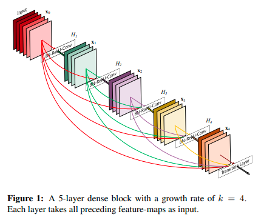
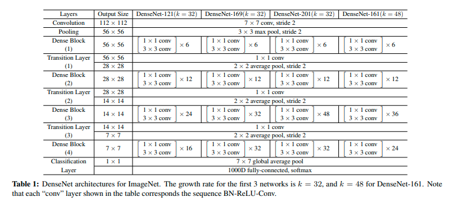

```python
import torch
import torch.nn as nn
import numpy as np
```

***
### DENSENET / DENSENET-B / DENSENET-BC
### CLASSIFICATION MODEL IMPLEMENTATION 
***



Source : https://openaccess.thecvf.com/content_cvpr_2017/papers/Huang_Densely_Connected_Convolutional_CVPR_2017_paper.pdf

***
Motivation of Dense Net :

**1.Introduction**

As CNNs become increasingly deep, a new research
problem emerges: as information about the input or gradient passes through many layers, it can vanish and “wash
out” by the time it reaches the end (or beginning) of the
network. 
[...]
In this paper, we propose an architecture that distills this
insight into a simple connectivity pattern: to ensure maximum information flow between layers in the network, we
connect all layers (with matching feature-map sizes) directly with each other.  To preserve the feed-forward nature,
each layer obtains additional inputs from all preceding layers and passes on its own feature-maps to all subsequent
layers.

Source : https://openaccess.thecvf.com/content_cvpr_2017/papers/Huang_Densely_Connected_Convolutional_CVPR_2017_paper.pdf

***
**Parameters efficiency of Dense Net:**
    
A possibly counter-intuitive effect of this dense connectivity pattern is that it requires fewer parameters than traditional convolutional networks, as there is no need to relearn redundant feature-maps.

Traditional feed-forward architectures can be viewed as algorithms with a state, which
is passed on from layer to layer. Each layer reads the state
from its preceding layer and writes to the subsequent layer.
It changes the state but also passes on information that needs
to be preserved.

Our proposed DenseNet architecture explicitly differentiates between information that is added to the network and information that is preserved. DenseNet layers are very narrow (e.g., 12 filters per layer),adding only a small set of feature-maps to the “collective
knowledge” of the network and keep the remaining feature maps unchanged—and the final classifier makes a decision
based on all feature-maps in the network.

Source : https://openaccess.thecvf.com/content_cvpr_2017/papers/Huang_Densely_Connected_Convolutional_CVPR_2017_paper.pdf

***
The implementation below is intended to allow the possibility of implementing all the architectures proposed in **Table 1. DenseNet architectures for ImageNet.**



Source : https://openaccess.thecvf.com/content_cvpr_2017/papers/Huang_Densely_Connected_Convolutional_CVPR_2017_paper.pdf

***
### Dense Block (option : bottleneck layers)


```python
class DenseBlock(nn.Module):
    def __init__(self, dense_block_size, in_channels, k, bottleneck_layers=True):
        super().__init__();
        
        self.dense_block = [];
        
        for i in range(dense_block_size):
            if bottleneck_layers is True:
                H_l1 = nn.Sequential(nn.BatchNorm2d(in_channels),
                                     nn.ReLU(),
                                     nn.Conv2d(in_channels, 4*k, kernel_size=1));
                H_l2 = nn.Sequential(nn.BatchNorm2d(4*k),
                                     nn.ReLU(),
                                     nn.Conv2d(4*k, k, kernel_size=3, padding=1));
                
                self.dense_block.append(nn.Sequential(H_l1, H_l2));
                
            else:
                H_l = nn.Sequential(nn.BatchNorm2d(in_channels),
                                    nn.ReLU(),
                                    nn.Conv2d(in_channels, k, kernel_size=3, padding=1));
                
                self.dense_block.append(H_l);
                
            
            in_channels += k;
            
        
    def forward(self, X):
        
        for block in self.dense_block:
            Y = block(X);
            X = torch.cat((Y,X), dim=1);
            
        return X;
```

***
### Transition Layer (option : Compression)


```python
def TransitionLayer(in_channels, compression_factor=1):
    return nn.Sequential(nn.BatchNorm2d(in_channels),
                         nn.Conv2d(in_channels, int(np.floor(compression_factor*in_channels)), kernel_size=1),
                         nn.AvgPool2d(kernel_size=2, stride=2));
```

***
### DenseNet-L Model


```python
def DenseNetL(num_layers, in_channels, bottleneck_layers=True, compression_factor=1):
    
    # DENSENET HYPERPARAMETERS
    
    arch_num_blocks = {121:(6,12,24,16), 
                       169:(6,12,32,32), 
                       201:(6,12,48,32), 
                       161:(6,12,36,24)};

    arch_num_blocks_selected = None;
    k = None;

    if np.isin(num_layers,(121,169,201,161)):
        arch_num_blocks_selected = arch_num_blocks[num_layers];

        if num_layers == 161:
            k = 48;
        else:
            k = 32;
    else:
        raise ValueError("<num_layers> doesn't represent a known architecture.");

    # DENSENET MODEL

    densenet = nn.Sequential();

    init_block = nn.Sequential(nn.Conv2d(in_channels, 2*k, kernel_size=7, stride=2, padding=3),
                                nn.BatchNorm2d(2*k),
                                nn.ReLU(),
                                nn.MaxPool2d(kernel_size=3, stride=2, padding=1));
    densenet.append(init_block);

    in_channels = 2*k;
    for i in range(4):
        dense_block_size = arch_num_blocks_selected[i];
        densenet.append(DenseBlock(dense_block_size, in_channels, k, bottleneck_layers));

        in_channels_tlayer = in_channels + dense_block_size*k;

        if i < 3:
            densenet.append(TransitionLayer(in_channels_tlayer, compression_factor));
            in_channels = int(np.floor(in_channels_tlayer*compression_factor));
        else:
            in_channels = in_channels_tlayer;

    closing_block = nn.Sequential(nn.AdaptiveAvgPool2d((1,1)),
                                  nn.Flatten(),
                                  nn.Linear(in_channels, 1000));
    densenet.append(closing_block);

    return densenet;
```

***
### DenseNet-169


```python
X = torch.rand(5,3,224,224);
DenseNet_169 = DenseNetL(169, X.shape[1], False);

for blk in DenseNet_169:
    X = blk(X);
    print(blk.__class__.__name__,'output shape:\t', X.shape);
```

    Sequential output shape:	 torch.Size([5, 64, 56, 56])
    DenseBlock output shape:	 torch.Size([5, 256, 56, 56])
    Sequential output shape:	 torch.Size([5, 256, 28, 28])
    DenseBlock output shape:	 torch.Size([5, 640, 28, 28])
    Sequential output shape:	 torch.Size([5, 640, 14, 14])
    DenseBlock output shape:	 torch.Size([5, 1664, 14, 14])
    Sequential output shape:	 torch.Size([5, 1664, 7, 7])
    DenseBlock output shape:	 torch.Size([5, 2688, 7, 7])
    Sequential output shape:	 torch.Size([5, 1000])


***
### DenseNetB-161


```python
X = torch.rand(5,3,224,224);
DenseNetB_161 = DenseNetL(161, X.shape[1], True);

for blk in DenseNetB_161:
    X = blk(X);
    print(blk.__class__.__name__,'output shape:\t', X.shape);
```

    Sequential output shape:	 torch.Size([5, 96, 56, 56])
    DenseBlock output shape:	 torch.Size([5, 384, 56, 56])
    Sequential output shape:	 torch.Size([5, 384, 28, 28])
    DenseBlock output shape:	 torch.Size([5, 960, 28, 28])
    Sequential output shape:	 torch.Size([5, 960, 14, 14])
    DenseBlock output shape:	 torch.Size([5, 2688, 14, 14])
    Sequential output shape:	 torch.Size([5, 2688, 7, 7])
    DenseBlock output shape:	 torch.Size([5, 3840, 7, 7])
    Sequential output shape:	 torch.Size([5, 1000])


***
### DenseNetBC-161


```python
X = torch.rand(5,3,224,224);
DenseNetBC_161 = DenseNetL(161, X.shape[1], True, 0.5);

for blk in DenseNetBC_161:
    X = blk(X);
    print(blk.__class__.__name__,'output shape:\t', X.shape);
```

    Sequential output shape:	 torch.Size([5, 96, 56, 56])
    DenseBlock output shape:	 torch.Size([5, 384, 56, 56])
    Sequential output shape:	 torch.Size([5, 192, 28, 28])
    DenseBlock output shape:	 torch.Size([5, 768, 28, 28])
    Sequential output shape:	 torch.Size([5, 384, 14, 14])
    DenseBlock output shape:	 torch.Size([5, 2112, 14, 14])
    Sequential output shape:	 torch.Size([5, 1056, 7, 7])
    DenseBlock output shape:	 torch.Size([5, 2208, 7, 7])
    Sequential output shape:	 torch.Size([5, 1000])

