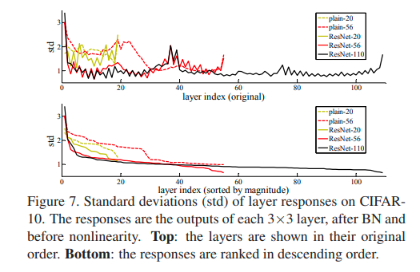
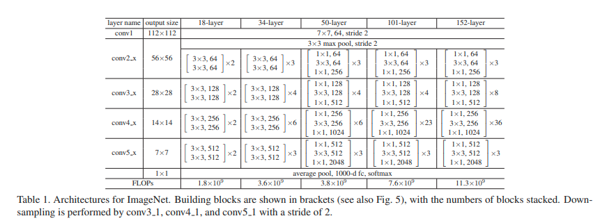

```python
import torch
import torch.nn as nn
import torch.nn.functional as F
import numpy as np
```

***
### RESNET CLASSIFICATION MODEL IMPLEMENTATION 
***

Motivation of residual learning :

#### 3.1. Residual Learning

Let us consider H(x) as an underlying mapping to be
fit by a few stacked layers (not necessarily the entire net),
with x denoting the inputs to the first of these layers. If one
hypothesizes that multiple nonlinear layers can asymptotically approximate complicated functions, then it is equivalent to hypothesize that they can asymptotically approximate the residual functions, i.e., H(x) − x (assuming that
the input and output are of the same dimensions). 

So rather than expect stacked layers to approximate H(x), we
explicitly let these layers approximate a residual function
F(x) := H(x) − x. The original function thus becomes
F(x)+x. Although both forms should be able to asymptotically approximate the desired functions (as hypothesized),
the ease of learning might be different.

**This reformulation is motivated by the counterintuitive
phenomena about the degradation problem (Fig. 1, left). As
we discussed in the introduction, if the added layers can
be constructed as identity mappings, a deeper model should
have training error no greater than its shallower counterpart. The degradation problem suggests that the solvers
might have difficulties in approximating identity mappings
by multiple nonlinear layers. With the residual learning reformulation, if identity mappings are optimal, the solvers
may simply drive the weights of the multiple nonlinear layers toward zero to approach identity mappings.**

In real cases, it is unlikely that identity mappings are optimal, but our reformulation may help to precondition the
problem. If the optimal function is closer to an identity
mapping than to a zero mapping, it should be easier for the
solver to find the perturbations with reference to an identity
mapping, than to learn the function as a new one. We show
by experiments (Fig. 7) that the learned residual functions in
general have small responses, suggesting that identity mappings provide reasonable preconditioning.


...

**Analysis of Layer Responses.** Fig. 7 shows the standard
deviations (std) of the layer responses. The responses are
the outputs of each 3×3 layer, after BN and before other
nonlinearity (ReLU/addition). For ResNets, this analysis reveals the response strength of the residual functions.
Fig. 7 shows that ResNets have generally smaller responses
than their plain counterparts. These results support our basic motivation (Sec.3.1) that the residual functions might
be generally closer to zero than the non-residual functions.
We also notice that the deeper ResNet has smaller magnitudes of responses, as evidenced by the comparisons among
ResNet-20, 56, and 110 in Fig. 7. When there are more
layers, an individual layer of ResNets tends to modify the
signal less.


Source : https://www.cv-foundation.org/openaccess/content_cvpr_2016/papers/He_Deep_Residual_Learning_CVPR_2016_paper.pdf



Source : https://www.cv-foundation.org/openaccess/content_cvpr_2016/papers/He_Deep_Residual_Learning_CVPR_2016_paper.pdf

***
The implementation below is intended to allow the possibility of implementing all the architectures proposed in **Table 1. Architectures for ImageNet.**



Source : https://www.cv-foundation.org/openaccess/content_cvpr_2016/papers/He_Deep_Residual_Learning_CVPR_2016_paper.pdf

***
### *Residual Block*


```python
class ResidualBlockType1(nn.Module):
    def __init__(self, in_channels, out_channels, stride=1):
        super().__init__();
        
        self.is_in_out_shape_conform = (in_channels == out_channels) and stride == 1;
        
        if self.is_in_out_shape_conform is False:
            self.conform_layer = nn.Conv2d(in_channels, out_channels, kernel_size=1, stride=stride);
        
        self.l1 = nn.Conv2d(in_channels, out_channels, kernel_size=3, padding=1, stride=stride);
        self.l2 = nn.Conv2d(out_channels, out_channels, kernel_size=3, padding=1);
        
        self.BN1 = nn.BatchNorm2d(out_channels);
        self.BN2 = nn.BatchNorm2d(out_channels);
    
    def forward(self, X):
        residual = F.relu(self.BN1(self.l1(X)));
        residual = self.BN2(self.l2(residual));
        
        if self.is_in_out_shape_conform is False:
            X = self.conform_layer(X);
        
        return F.relu(residual + X);
```


```python
class ResidualBlockType2(nn.Module):
    def __init__(self, in_channels, out_channels, stride=1):
        super().__init__();
        
        self.conform_layer = nn.Conv2d(in_channels, 4*out_channels, kernel_size=1, stride=stride);

        self.l1 = nn.Conv2d(in_channels, out_channels, kernel_size=1, stride=stride);
        self.l2 = nn.Conv2d(out_channels, out_channels, kernel_size=3, padding=1);
        self.l3 = nn.Conv2d(out_channels, 4*out_channels, kernel_size=1);
        
        self.BN1 = nn.BatchNorm2d(out_channels);
        self.BN2 = nn.BatchNorm2d(out_channels);
        self.BN3 = nn.BatchNorm2d(4*out_channels);

    def forward(self, X):
        
        residual = F.relu(self.BN1(self.l1(X)));
        residual = F.relu(self.BN2(self.l2(residual)));
        residual = self.BN3(self.l3(residual));
        
        X = self.conform_layer(X);
        
        return F.relu(residual + X);
```

***
### *ResNet-L Model*

Type1 = (18/34)-layers architectures;    
Type2 = (50/101/152)-layers architectures;


```python
def ResNetL(num_layers, in_channels):
    
    ResNetL_sequential = nn.Sequential();
    is_Type1 = None;
    arch_num_blocks_selected = None;
    arch_num_blocks = {18:(2,2,2,2), 
                       34:(3,4,6,3), 
                       50:(3,4,6,3), 
                       101:(3,4,23,3), 
                       152:(3,8,36,3)};
    
    if np.isin(num_layers,(18,34)):
        is_Type1 = True;
    elif np.isin(num_layers,(50,101,152)):
        is_Type1 = False;
    else:
        raise ValueError("<num_layers> doesn't represent a known architecture.");
    
    arch_num_blocks_selected = arch_num_blocks[num_layers];   
        
    for i in range(4):
        out_channels = 2**i * 64;
        ResNetL_sequential_i = nn.Sequential();
        
        for j in range(arch_num_blocks_selected[i]):
            stride = 2 if (np.isin(i, (1,2,3)) and j == 0) else 1;
            
            if is_Type1 is True:
                ResNetL_sequential_i.append(ResidualBlockType1(in_channels, out_channels, stride));
                in_channels = out_channels;
            else:
                ResNetL_sequential_i.append(ResidualBlockType2(in_channels, out_channels, stride));
                in_channels = 4*out_channels;
        
        ResNetL_sequential.append(ResNetL_sequential_i);
    
    return ResNetL_sequential;
```

### *ResNet-34*


```python
num_layers_net34 = 34;
num_out_channels_net34 = 512;

ResNet34 = nn.Sequential(nn.Conv2d(3,64, kernel_size=7, stride=2, padding=3),
                       nn.MaxPool2d(kernel_size=3, stride=2, padding=1),
                       ResNetL(num_layers_net34, 64),
                       nn.AdaptiveAvgPool2d((1,1)),
                       nn.Flatten(),
                       nn.Linear(num_out_channels_net34, 1000));
```


```python
X = torch.randn(size=(5,3,224,224));
for blk in ResNet34:
    X = blk(X);
    print(blk.__class__.__name__,'output shape:\t', X.shape);
```

    Conv2d output shape:	 torch.Size([5, 64, 112, 112])
    MaxPool2d output shape:	 torch.Size([5, 64, 56, 56])
    Sequential output shape:	 torch.Size([5, 512, 7, 7])
    AdaptiveAvgPool2d output shape:	 torch.Size([5, 512, 1, 1])
    Flatten output shape:	 torch.Size([5, 512])
    Linear output shape:	 torch.Size([5, 1000])


### *ResNet-101*


```python
num_layers_net101 = 101;
num_out_channels_net101 = 2048;

ResNet101 = nn.Sequential(nn.Conv2d(3,64, kernel_size=7, stride=2, padding=3),
                       nn.MaxPool2d(kernel_size=3, stride=2, padding=1),
                       ResNetL(num_layers_net101, 64),
                       nn.AdaptiveAvgPool2d((1,1)),
                       nn.Flatten(),
                       nn.Linear(num_out_channels_net101, 1000));
```


```python
X = torch.randn(size=(5,3,224,224));
for blk in ResNet101:
    X = blk(X);
    print(blk.__class__.__name__,'output shape:\t', X.shape);
```

    Conv2d output shape:	 torch.Size([5, 64, 112, 112])
    MaxPool2d output shape:	 torch.Size([5, 64, 56, 56])
    Sequential output shape:	 torch.Size([5, 2048, 7, 7])
    AdaptiveAvgPool2d output shape:	 torch.Size([5, 2048, 1, 1])
    Flatten output shape:	 torch.Size([5, 2048])
    Linear output shape:	 torch.Size([5, 1000])

