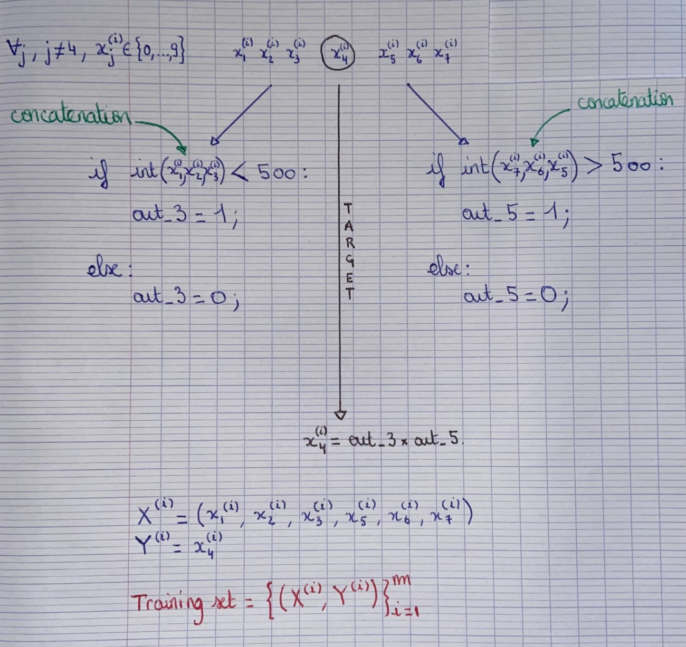

```python
import torch
import torch.nn as nn
import numpy as np
```

***
### BIDIRECTIONAL RECURRENT NEURAL NETWORK IMPLEMENTATION FROM SCRATCH
***

;

### *DATA*


```python
num_data = 5000;
n = 500;

X = torch.floor(10*torch.rand((num_data, 6)));
Y = torch.empty((num_data,));

for i in range(num_data):
    seqf, seqb = "", "";
    for u in range(3):
        seqf = seqf + str(int(X[i,0:3][u].item()));
        seqb = seqb + str(int(X[i,3:6][2-u].item()));
        
    out_3 = 1 if int(seqf) < 500 else 0;
    out_5 = 1 if int(seqb) > 500 else 0;
    
    Y[i] = out_3*out_5;
```


```python
num_training_data = int(np.floor(num_data*0.75));

X_train = X[0:num_training_data];
Y_train = Y[0:num_training_data];

X_test = X[num_training_data:];
Y_test = Y[num_training_data:];
```

***
### *DATA LOADER*


```python
def XYdataLoader(X, Y, batch_size, shuffle):

    dataset = torch.utils.data.TensorDataset(X,Y);
    
    return torch.utils.data.DataLoader(dataset, batch_size, shuffle=shuffle, num_workers=2);
```


```python
batch_size = 5000;

dataset_train = XYdataLoader(X_train, Y_train, batch_size, True);
dataset_test = XYdataLoader(X_test, Y_test, batch_size, False);
```

***
### *MODEL*


```python
class BRNN(nn.Module):
    def __init__(self, x_size, h_size, q_size):
        super().__init__();
            
        self.fW_xh = nn.Parameter(torch.randn(x_size, h_size));
        self.fW_hh = nn.Parameter(torch.randn(h_size, h_size));
        self.fb_h = nn.Parameter(torch.zeros(h_size));
        
        self.bW_xh = nn.Parameter(torch.randn(x_size, h_size));
        self.bW_hh = nn.Parameter(torch.randn(h_size, h_size));
        self.bb_h = nn.Parameter(torch.zeros(h_size));
        
        self.fW_hq = nn.Parameter(torch.randn(h_size, q_size));
        self.fb_q = nn.Parameter(torch.zeros(q_size));
        
        self.bW_hq = nn.Parameter(torch.randn(h_size, q_size));
        self.bb_q = nn.Parameter(torch.zeros(q_size));
        

    def forward(self, fX, bX):
        
        fH, bH = None, None;
        RL = torch.nn.ReLU();
        
        ## A always refers to the inputs (X,H).
        ## B always refers to the parameters (W).
        matmul = lambda A,B: torch.matmul(A,B) if A is not None else 0;
        
        for i in range(len(fX)):
            fH = RL(matmul(fX[i], self.fW_xh) + matmul(fH, self.fW_hh) + self.fb_h);
        
        for i in range(len(bX)):
            bH = RL(matmul(bX[i], self.bW_xh) + matmul(bH, self.bW_hh) + self.bb_h);
            
        out_3 = matmul(fH, self.fW_hq) + self.fb_q;
        out_5 = matmul(bH, self.bW_hq) + self.bb_q;
        
        return out_3 * out_5;
```

***
### *LOSS*


```python
def loss(Y_hat, Y):    
    return ((Y_hat-Y)**2).mean();
```

***
### *TRANSFORMATIONS*


```python
def XTransform(X, flip=False):

    if flip == True:
        X = torch.flip(X,dims=(1,));
        
    X = torch.transpose(X,0,1);
    X = X.reshape(X.shape[0], -1, 1);
    
    return X;
```

***
### *GRADIENT CLIPPING*

I use equation **(9.5.3)** defined in https://d2l.ai/chapter_recurrent-neural-networks/rnn-scratch.html#gradient-clipping and i define:    
**theta = alpha*torch.numel(param.grad)** where **alpha** is a hyperparameter.


```python
def gradientClipping(brnn, alpha=1):
    for param in brnn.parameters():
        if param.requires_grad:
            norm = torch.norm(param.grad.flatten());
            theta = alpha*param.numel();
            
            if norm > theta:
                param.grad *= theta/norm;
```

***
### *TRAINING*


```python
def trainBRNN(brnn, dataset, loss, optimizer, num_epochs, alpha=1):
    
    brnn.train();
    
    for epoch in range(num_epochs):
        fX_test, bX_test, Y_test = None, None, None;

        for X,Y in dataset:
            fX, bX = XTransform(X[:,0:3]), XTransform(X[:,3:6], flip=True);
            l = loss(brnn(fX, bX), Y);

            with torch.no_grad():
                l.backward();
                gradientClipping(brnn, alpha);
                optimizer.step();
                optimizer.zero_grad();

            if fX_test == None and bX_test == None and Y_test == None:
                fX_test, bX_test, Y_test = fX, bX, Y;
            
        print(f'Training loss {loss(brnn(fX_test, bX_test), Y_test)}');
        print(f'Epoch {epoch}');                        
        
    return brnn;
```


```python
brnn = BRNN(1, 32, 1);
```


```python
for i in range(2):
    optimizer = torch.optim.SGD(brnn.parameters(), lr=0.1/10**i);    
    brnn_trained = trainBRNN(brnn, dataset_train, loss, optimizer, (i+1)*100);
```

    Training loss 6.742625349323981e+16
    Epoch 0
    Training loss 13166215168.0
    Epoch 1
    Training loss 57544688.0
    Epoch 2
    Training loss 2221302016.0
    Epoch 3
    Training loss 0.5333425998687744
    Epoch 4
    Training loss 0.24795179069042206
    Epoch 5
    Training loss 0.24758851528167725
    Epoch 6
    Training loss 0.24719271063804626
    Epoch 7
    Training loss 0.24676166474819183
    Epoch 8
    Training loss 0.24629230797290802
    Epoch 9
    Training loss 0.24578158557415009
    Epoch 10
    Training loss 0.24522635340690613
    Epoch 11
    Training loss 0.24462328851222992
    Epoch 12
    Training loss 0.24396906793117523
    Epoch 13
    Training loss 0.24326033890247345
    Epoch 14
    Training loss 0.24249376356601715
    Epoch 15
    Training loss 0.24166591465473175
    Epoch 16
    Training loss 0.24077370762825012
    Epoch 17
    Training loss 0.23981396853923798
    Epoch 18
    Training loss 0.23878182470798492
    Epoch 19
    Training loss 0.23767797648906708
    Epoch 20
    Training loss 0.23650239408016205
    Epoch 21
    Training loss 0.23525166511535645
    Epoch 22
    Training loss 0.2339252084493637
    Epoch 23
    Training loss 0.2325233668088913
    Epoch 24
    Training loss 0.2310476452112198
    Epoch 25
    Training loss 0.22950077056884766
    Epoch 26
    Training loss 0.22788618505001068
    Epoch 27
    Training loss 0.22620859742164612
    Epoch 28
    Training loss 0.22447434067726135
    Epoch 29
    Training loss 0.2226908802986145
    Epoch 30
    Training loss 0.22086705267429352
    Epoch 31
    Training loss 0.21901482343673706
    Epoch 32
    Training loss 0.21714340150356293
    Epoch 33
    Training loss 0.21526487171649933
    Epoch 34
    Training loss 0.21339191496372223
    Epoch 35
    Training loss 0.2115374356508255
    Epoch 36
    Training loss 0.20971451699733734
    Epoch 37
    Training loss 0.20793592929840088
    Epoch 38
    Training loss 0.20621372759342194
    Epoch 39
    Training loss 0.20455893874168396
    Epoch 40
    Training loss 0.2029813975095749
    Epoch 41
    Training loss 0.20148932933807373
    Epoch 42
    Training loss 0.20008988678455353
    Epoch 43
    Training loss 0.19878794252872467
    Epoch 44
    Training loss 0.1975853145122528
    Epoch 45
    Training loss 0.1964828372001648
    Epoch 46
    Training loss 0.19547989964485168
    Epoch 47
    Training loss 0.19457422196865082
    Epoch 48
    Training loss 0.19376224279403687
    Epoch 49
    Training loss 0.19303926825523376
    Epoch 50
    Training loss 0.19239982962608337
    Epoch 51
    Training loss 0.19183796644210815
    Epoch 52
    Training loss 0.19134719669818878
    Epoch 53
    Training loss 0.19092099368572235
    Epoch 54
    Training loss 0.19055286049842834
    Epoch 55
    Training loss 0.19023649394512177
    Epoch 56
    Training loss 0.18996599316596985
    Epoch 57
    Training loss 0.18973560631275177
    Epoch 58
    Training loss 0.18954025208950043
    Epoch 59
    Training loss 0.18937522172927856
    Epoch 60
    Training loss 0.18923622369766235
    Epoch 61
    Training loss 0.18911957740783691
    Epoch 62
    Training loss 0.18902191519737244
    Epoch 63
    Training loss 0.18894033133983612
    Epoch 64
    Training loss 0.1888723224401474
    Epoch 65
    Training loss 0.18881571292877197
    Epoch 66
    Training loss 0.18876869976520538
    Epoch 67
    Training loss 0.18872962892055511
    Epoch 68
    Training loss 0.1886972039937973
    Epoch 69
    Training loss 0.1886702924966812
    Epoch 70
    Training loss 0.18864791095256805
    Epoch 71
    Training loss 0.18862932920455933
    Epoch 72
    Training loss 0.18861384689807892
    Epoch 73
    Training loss 0.18860092759132385
    Epoch 74
    Training loss 0.18859007954597473
    Epoch 75
    Training loss 0.18858104944229126
    Epoch 76
    Training loss 0.18857334554195404
    Epoch 77
    Training loss 0.18856686353683472
    Epoch 78
    Training loss 0.1885613203048706
    Epoch 79
    Training loss 0.18855655193328857
    Epoch 80
    Training loss 0.1885523945093155
    Epoch 81
    Training loss 0.1885487586259842
    Epoch 82
    Training loss 0.1885455697774887
    Epoch 83
    Training loss 0.18854272365570068
    Epoch 84
    Training loss 0.18854017555713654
    Epoch 85
    Training loss 0.1885378509759903
    Epoch 86
    Training loss 0.18853572010993958
    Epoch 87
    Training loss 0.1885337084531784
    Epoch 88
    Training loss 0.18853187561035156
    Epoch 89
    Training loss 0.18853014707565308
    Epoch 90
    Training loss 0.18852846324443817
    Epoch 91
    Training loss 0.18852689862251282
    Epoch 92
    Training loss 0.18852539360523224
    Epoch 93
    Training loss 0.18852391839027405
    Epoch 94
    Training loss 0.18852248787879944
    Epoch 95
    Training loss 0.1885211020708084
    Epoch 96
    Training loss 0.18851971626281738
    Epoch 97
    Training loss 0.18851840496063232
    Epoch 98
    Training loss 0.18851710855960846
    Epoch 99
    Training loss 0.18851697444915771
    Epoch 0
    Training loss 0.18851681053638458
    Epoch 1
    Training loss 0.18851670622825623
    Epoch 2
    Training loss 0.18851658701896667
    Epoch 3
    Training loss 0.18851643800735474
    Epoch 4
    Training loss 0.188516303896904
    Epoch 5
    Training loss 0.18851618468761444
    Epoch 6
    Training loss 0.1885160654783249
    Epoch 7
    Training loss 0.18851593136787415
    Epoch 8
    Training loss 0.1885157972574234
    Epoch 9
    Training loss 0.18851567804813385
    Epoch 10
    Training loss 0.1885155588388443
    Epoch 11
    Training loss 0.18851545453071594
    Epoch 12
    Training loss 0.188515305519104
    Epoch 13
    Training loss 0.18851517140865326
    Epoch 14
    Training loss 0.1885150521993637
    Epoch 15
    Training loss 0.18851491808891296
    Epoch 16
    Training loss 0.1885148137807846
    Epoch 17
    Training loss 0.18851466476917267
    Epoch 18
    Training loss 0.1885145604610443
    Epoch 19
    Training loss 0.18851444125175476
    Epoch 20
    Training loss 0.18851429224014282
    Epoch 21
    Training loss 0.18851417303085327
    Epoch 22
    Training loss 0.18851403892040253
    Epoch 23
    Training loss 0.1885138899087906
    Epoch 24
    Training loss 0.18851381540298462
    Epoch 25
    Training loss 0.18851366639137268
    Epoch 26
    Training loss 0.18851356208324432
    Epoch 27
    Training loss 0.18851342797279358
    Epoch 28
    Training loss 0.18851329386234283
    Epoch 29
    Training loss 0.18851320445537567
    Epoch 30
    Training loss 0.18851307034492493
    Epoch 31
    Training loss 0.188512921333313
    Epoch 32
    Training loss 0.18851280212402344
    Epoch 33
    Training loss 0.1885126829147339
    Epoch 34
    Training loss 0.18851253390312195
    Epoch 35
    Training loss 0.1885124295949936
    Epoch 36
    Training loss 0.18851229548454285
    Epoch 37
    Training loss 0.1885121464729309
    Epoch 38
    Training loss 0.18851207196712494
    Epoch 39
    Training loss 0.18851196765899658
    Epoch 40
    Training loss 0.18851183354854584
    Epoch 41
    Training loss 0.1885116994380951
    Epoch 42
    Training loss 0.18851158022880554
    Epoch 43
    Training loss 0.1885114461183548
    Epoch 44
    Training loss 0.18851135671138763
    Epoch 45
    Training loss 0.1885111927986145
    Epoch 46
    Training loss 0.18851107358932495
    Epoch 47
    Training loss 0.1885109543800354
    Epoch 48
    Training loss 0.18851086497306824
    Epoch 49
    Training loss 0.1885107159614563
    Epoch 50
    Training loss 0.18851058185100555
    Epoch 51
    Training loss 0.1885104775428772
    Epoch 52
    Training loss 0.18851035833358765
    Epoch 53
    Training loss 0.1885102540254593
    Epoch 54
    Training loss 0.18851010501384735
    Epoch 55
    Training loss 0.1885099709033966
    Epoch 56
    Training loss 0.18850986659526825
    Epoch 57
    Training loss 0.1885097622871399
    Epoch 58
    Training loss 0.18850961327552795
    Epoch 59
    Training loss 0.1885095089673996
    Epoch 60
    Training loss 0.18850938975811005
    Epoch 61
    Training loss 0.1885092854499817
    Epoch 62
    Training loss 0.18850913643836975
    Epoch 63
    Training loss 0.1885090470314026
    Epoch 64
    Training loss 0.18850891292095184
    Epoch 65
    Training loss 0.1885087937116623
    Epoch 66
    Training loss 0.18850864470005035
    Epoch 67
    Training loss 0.1885085552930832
    Epoch 68
    Training loss 0.18850845098495483
    Epoch 69
    Training loss 0.1885083019733429
    Epoch 70
    Training loss 0.18850819766521454
    Epoch 71
    Training loss 0.188508078455925
    Epoch 72
    Training loss 0.18850794434547424
    Epoch 73
    Training loss 0.1885078400373459
    Epoch 74
    Training loss 0.18850773572921753
    Epoch 75
    Training loss 0.1885075867176056
    Epoch 76
    Training loss 0.18850745260715485
    Epoch 77
    Training loss 0.1885073482990265
    Epoch 78
    Training loss 0.18850725889205933
    Epoch 79
    Training loss 0.18850712478160858
    Epoch 80
    Training loss 0.18850702047348022
    Epoch 81
    Training loss 0.18850690126419067
    Epoch 82
    Training loss 0.18850675225257874
    Epoch 83
    Training loss 0.18850666284561157
    Epoch 84
    Training loss 0.18850654363632202
    Epoch 85
    Training loss 0.1885063797235489
    Epoch 86
    Training loss 0.18850630521774292
    Epoch 87
    Training loss 0.18850618600845337
    Epoch 88
    Training loss 0.18850603699684143
    Epoch 89
    Training loss 0.18850591778755188
    Epoch 90
    Training loss 0.18850578367710114
    Epoch 91
    Training loss 0.18850569427013397
    Epoch 92
    Training loss 0.18850557506084442
    Epoch 93
    Training loss 0.18850550055503845
    Epoch 94
    Training loss 0.18850533664226532
    Epoch 95
    Training loss 0.18850524723529816
    Epoch 96
    Training loss 0.1885051131248474
    Epoch 97
    Training loss 0.18850502371788025
    Epoch 98
    Training loss 0.1885048896074295
    Epoch 99
    Training loss 0.18850477039813995
    Epoch 100
    Training loss 0.1885046511888504
    Epoch 101
    Training loss 0.18850453197956085
    Epoch 102
    Training loss 0.1885043978691101
    Epoch 103
    Training loss 0.18850432336330414
    Epoch 104
    Training loss 0.1885041743516922
    Epoch 105
    Training loss 0.18850408494472504
    Epoch 106
    Training loss 0.1885039359331131
    Epoch 107
    Training loss 0.18850386142730713
    Epoch 108
    Training loss 0.1885037124156952
    Epoch 109
    Training loss 0.18850360810756683
    Epoch 110
    Training loss 0.18850351870059967
    Epoch 111
    Training loss 0.1885034143924713
    Epoch 112
    Training loss 0.18850329518318176
    Epoch 113
    Training loss 0.18850314617156982
    Epoch 114
    Training loss 0.18850304186344147
    Epoch 115
    Training loss 0.18850289285182953
    Epoch 116
    Training loss 0.18850278854370117
    Epoch 117
    Training loss 0.188502699136734
    Epoch 118
    Training loss 0.18850259482860565
    Epoch 119
    Training loss 0.18850243091583252
    Epoch 120
    Training loss 0.18850232660770416
    Epoch 121
    Training loss 0.188502237200737
    Epoch 122
    Training loss 0.18850210309028625
    Epoch 123
    Training loss 0.1885020136833191
    Epoch 124
    Training loss 0.18850190937519073
    Epoch 125
    Training loss 0.18850179016590118
    Epoch 126
    Training loss 0.18850167095661163
    Epoch 127
    Training loss 0.18850155174732208
    Epoch 128
    Training loss 0.18850146234035492
    Epoch 129
    Training loss 0.1885012984275818
    Epoch 130
    Training loss 0.18850122392177582
    Epoch 131
    Training loss 0.18850111961364746
    Epoch 132
    Training loss 0.18850097060203552
    Epoch 133
    Training loss 0.18850086629390717
    Epoch 134
    Training loss 0.1885007619857788
    Epoch 135
    Training loss 0.18850065767765045
    Epoch 136
    Training loss 0.1885005086660385
    Epoch 137
    Training loss 0.18850037455558777
    Epoch 138
    Training loss 0.188500314950943
    Epoch 139
    Training loss 0.18850019574165344
    Epoch 140
    Training loss 0.18850009143352509
    Epoch 141
    Training loss 0.18849998712539673
    Epoch 142
    Training loss 0.1884998381137848
    Epoch 143
    Training loss 0.18849973380565643
    Epoch 144
    Training loss 0.18849964439868927
    Epoch 145
    Training loss 0.18849952518939972
    Epoch 146
    Training loss 0.18849940598011017
    Epoch 147
    Training loss 0.18849927186965942
    Epoch 148
    Training loss 0.18849916756153107
    Epoch 149
    Training loss 0.1884990632534027
    Epoch 150
    Training loss 0.18849892914295197
    Epoch 151
    Training loss 0.1884988397359848
    Epoch 152
    Training loss 0.18849872052669525
    Epoch 153
    Training loss 0.1884986013174057
    Epoch 154
    Training loss 0.18849848210811615
    Epoch 155
    Training loss 0.1884983777999878
    Epoch 156
    Training loss 0.18849827349185944
    Epoch 157
    Training loss 0.18849815428256989
    Epoch 158
    Training loss 0.18849806487560272
    Epoch 159
    Training loss 0.18849793076515198
    Epoch 160
    Training loss 0.188497856259346
    Epoch 161
    Training loss 0.18849773705005646
    Epoch 162
    Training loss 0.1884976029396057
    Epoch 163
    Training loss 0.18849746882915497
    Epoch 164
    Training loss 0.1884973794221878
    Epoch 165
    Training loss 0.18849730491638184
    Epoch 166
    Training loss 0.1884971559047699
    Epoch 167
    Training loss 0.18849706649780273
    Epoch 168
    Training loss 0.18849696218967438
    Epoch 169
    Training loss 0.18849681317806244
    Epoch 170
    Training loss 0.18849675357341766
    Epoch 171
    Training loss 0.18849660456180573
    Epoch 172
    Training loss 0.18849651515483856
    Epoch 173
    Training loss 0.1884964257478714
    Epoch 174
    Training loss 0.18849626183509827
    Epoch 175
    Training loss 0.1884961724281311
    Epoch 176
    Training loss 0.18849603831768036
    Epoch 177
    Training loss 0.1884959489107132
    Epoch 178
    Training loss 0.18849581480026245
    Epoch 179
    Training loss 0.1884957104921341
    Epoch 180
    Training loss 0.18849565088748932
    Epoch 181
    Training loss 0.18849551677703857
    Epoch 182
    Training loss 0.18849539756774902
    Epoch 183
    Training loss 0.18849529325962067
    Epoch 184
    Training loss 0.18849512934684753
    Epoch 185
    Training loss 0.18849506974220276
    Epoch 186
    Training loss 0.18849493563175201
    Epoch 187
    Training loss 0.18849484622478485
    Epoch 188
    Training loss 0.18849477171897888
    Epoch 189
    Training loss 0.18849460780620575
    Epoch 190
    Training loss 0.1884945183992386
    Epoch 191
    Training loss 0.18849442899227142
    Epoch 192
    Training loss 0.18849432468414307
    Epoch 193
    Training loss 0.18849420547485352
    Epoch 194
    Training loss 0.18849408626556396
    Epoch 195
    Training loss 0.18849396705627441
    Epoch 196
    Training loss 0.18849390745162964
    Epoch 197
    Training loss 0.1884937584400177
    Epoch 198
    Training loss 0.18849366903305054
    Epoch 199


***
### *TESTING*


```python
def testBRNN(brnn, dataset):
    
    L = [];
    
    for X,Y in dataset:
        fX, bX = XTransform(X[:,0:3]), XTransform(X[:,3:6], flip=True);
        l = loss(brnn(fX, bX), Y);
        
        L.append(l);
        
    print(f'mean loss at testing time {torch.tensor(L).mean()}');
```


```python
testBRNN(brnn_trained, dataset_test);
```

    mean loss at testing time 0.20345640182495117

