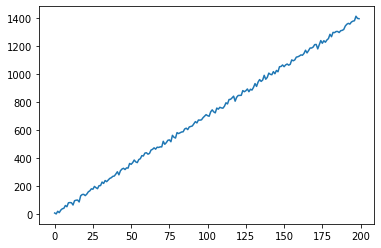
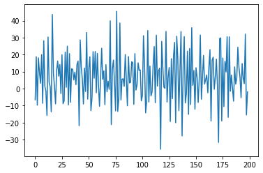
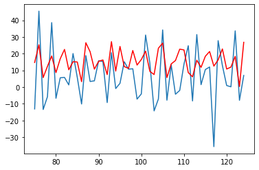
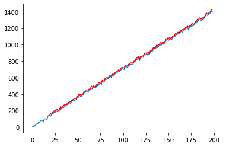
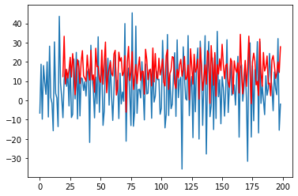

```python
import torch
import torch.nn as nn
import numpy as np
from scipy.io import wavfile
import matplotlib.pyplot as plt
```

***
### DEEP RECURRENT NEURAL NETWORK IMPLEMENTATION FROM SCRATCH
***

### *DATA*


```python
num_data = 200;

x = torch.arange(0,num_data, dtype=torch.float32);

B_0, B_1 = 5, 7;

data = B_0 + B_1*x;
data += torch.distributions.normal.Normal(0,10).sample((num_data,));
```


```python
fig1, ax1 = plt.subplots();
ax1.plot(x, data);
```


    

    


```python
data_trans = data[1:] - data[:-1];
```


```python
fig_t, ax_t = plt.subplots();
ax_t.plot(x[0:num_data-1], data_trans);
```


    

    


***
### *DATA LOADER*


```python
def sequencesPreparation(input_data_1d, sequence_len):
    X,Y = [], [];
    
    for i in range(len(input_data_1d) - sequence_len):
        X.append(input_data_1d[i:i+sequence_len]);
        Y.append(input_data_1d[(i+1):(i+1)+sequence_len]);

    return torch.stack(X), torch.stack(Y);
```


```python
def XYdataLoader(input_data_1d, sequence_len, batch_size, shuffle):
    
    X,Y = sequencesPreparation(input_data_1d, sequence_len);

    dataset = torch.utils.data.TensorDataset(X,Y);
    
    return torch.utils.data.DataLoader(dataset, batch_size, shuffle=shuffle, num_workers=2);
```


```python
sequence_len = 19;
batch_size = (num_data-1)-sequence_len;

dataset = XYdataLoader(data_trans, sequence_len, batch_size, True);
dataset_approx = XYdataLoader(data_trans, sequence_len, batch_size, False);
```

***
### *MODEL*

Note : 

If **U** is Uniform [0,1], then **(r2 - r1) * U + r1** is Uniform [r1,r2].

In the DRNN class, initialization of weight parameters is Uniform [-1,1].


```python
class DRNN(nn.Module):
    def __init__(self, num_layers, x_size, h_size, q_size):
        super().__init__();
        
        self.drnn_parameters = [];
        self.L = num_layers;
        
        for l in range(self.L):
            
            if l == 0:
                self.W_xh = nn.Parameter(2*torch.rand(x_size, h_size)-1);
            else:
                self.W_xh = nn.Parameter(2*torch.rand(h_size, h_size)-1);
                
            self.W_hh = nn.Parameter(2*torch.rand(h_size, h_size)-1);
            self.b_h = nn.Parameter(torch.zeros(h_size));

            if l+1 == self.L:
                self.W_hq = nn.Parameter(2*torch.rand(h_size, q_size)-1);
                self.b_q = nn.Parameter(torch.zeros(q_size));
                l_params = (self.W_xh, self.W_hh, self.b_h, self.W_hq, self.b_q);
            else:
                l_params = (self.W_xh, self.W_hh, self.b_h);
            
            self.drnn_parameters.append(l_params);

    def forward(self, X):

        outputs = [];
        
        ## hidden states previous layer
        hspl = [];
        
        ## A always refers to the inputs (X,H).
        ## B always refers to the parameters (W).
        matmul = lambda A,B: torch.matmul(A,B) if A is not None else 0;
        
        for l in range(self.L):
            Hl = None;
            
            if l+1 == self.L:
                W_xh, W_hh, b_h, W_hq, b_q = self.drnn_parameters[l];
            else:
                W_xh, W_hh, b_h = self.drnn_parameters[l];
            
            for t in range(len(X)):
                
                if l == 0:
                    Hl = matmul(X[t], W_xh) + matmul(Hl, W_hh) + b_h;
                    hspl.append(Hl);
                
                else:
                    Hl = matmul(hspl[t], W_xh) + matmul(Hl, W_hh) + b_h;
                    hspl[t] = Hl;
                    
        
        for t in range(len(hspl)):
            outputs.append(matmul(hspl[t], W_hq) + b_q);            
            
            
        return outputs;
```

***
### *LOSS*


```python
def loss(Y_hat, Y):
    
    Y_hat = torch.cat(Y_hat, dim=0);
    Y = Y.flatten().reshape(-1,1);
    
    return ((Y_hat-Y)**2).mean();
```

***
### *TRANSFORMATIONS*


```python
def XTransform(X):
    X = torch.transpose(X,0,1);
    X = X.reshape(X.shape[0], -1, 1);
    
    return X;
```


```python
def YTransform(Y):
    return torch.transpose(Y,0,1);
```

***
### *GRADIENT CLIPPING*

I use equation **(9.5.3)** defined in https://d2l.ai/chapter_recurrent-neural-networks/rnn-scratch.html#gradient-clipping and i define:    
**theta = alpha*torch.numel(param.grad)** where **alpha** is a hyperparameter.


```python
def gradientClipping(drnn, alpha=1):
    for param in drnn.parameters():
        if param.requires_grad:
            norm = torch.norm(param.grad.flatten());
            theta = alpha*param.numel();
            
            if norm > theta:
                param.grad *= theta/norm;
```

***
### *TRAINING*


```python
def trainDRNN(drnn, dataset, loss, optimizer, num_epochs, alpha=1):
    
    drnn.train();
    
    for epoch in range(num_epochs):
        X_test, Y_test = None, None;

        for X,Y in dataset:
            X = XTransform(X);
            Y = YTransform(Y);            
            l = loss(drnn(X), Y);

            with torch.no_grad():
                l.backward();
                gradientClipping(drnn, alpha);
                optimizer.step();
                optimizer.zero_grad();

            if X_test == None and Y_test == None:
                X_test, Y_test = X, Y;
            
        print(f'Training loss {loss(drnn(X_test), Y_test)}');
        print(f'Epoch {epoch}');                        
        
    return drnn;
```


```python
drnn = DRNN(2, 1, 8, 1);
```


```python
optimizer = torch.optim.SGD(drnn.parameters(), lr=0.0001);
```


```python
drnn_trained = trainDRNN(drnn, dataset, loss, optimizer, 5000);
```

    Training loss 203.22109985351562
    Epoch 0
    Training loss 205.78643798828125
    Epoch 1
    Training loss 203.05300903320312
    Epoch 2
    Training loss 205.32745361328125
    Epoch 3
    ...
    Training loss 187.93157958984375
    Epoch 4996
    Training loss 192.28366088867188
    Epoch 4997
    Training loss 187.92942810058594
    Epoch 4998
    Training loss 192.2818145751953
    Epoch 4999


***
### *APPROXIMATION OF THE DATA OF THE DRNN*


```python
def DRNNapproximation(drnn, dataset):
    
    drnn.eval();
    with torch.no_grad():
        Y_hat = None;

        for X,Y in dataset:
            X = XTransform(X);
            Y_hat_batch = drnn(X);

            if Y_hat == None:
                Y_hat = Y_hat_batch[-1];
            else:
                Y_hat = torch.cat([Y_hat, Y_hat_batch[-1]], dim=0);
        
    return Y_hat;
```


```python
Y_hat = DRNNapproximation(drnn_trained, dataset_approx);
Y_hat = Y_hat.flatten();
Y_hat.shape
```


    torch.Size([180])


```python
fig2, ax2 = plt.subplots();
ax2.plot(x[0:num_data-1], data_trans);
ax2.plot(torch.arange(sequence_len,num_data-1), Y_hat.detach().numpy(), color="r");
```


    

    


```python
fig_zoom, ax_zoom = plt.subplots();
ax_zoom.plot(x[75:125], data_trans[75:125]);
ax_zoom.plot(torch.arange(75,125), Y_hat.detach().numpy()[75-sequence_len:125-sequence_len], color="r");
```


    

    


```python
data_approx = Y_hat + data[sequence_len:-1];

fig3, ax3 = plt.subplots();
ax3.plot(x, data);
ax3.plot(torch.arange(sequence_len,num_data-1), data_approx.detach().numpy(), color="r");
```


    

    


***
### DEEP RECURRENT NEURAL NETWORK CONCISE IMPLEMENTATION
***


```python
def trainCDEEPRNN(drnn, dataset, loss, optimizer, num_epochs, alpha=1):
    
    drnn.train();
    
    for epoch in range(num_epochs):
        X_test, Y_test = None, None;

        for X,Y in dataset:
            X = XTransform(X);
            Y = YTransform(Y);
            l = loss(drnn(X), Y);
            
            with torch.no_grad():
                l.backward();
                optimizer.step();
                optimizer.zero_grad();

            if X_test == None and Y_test == None:
                X_test, Y_test = X, Y;
            
        print(f'Training loss {loss(drnn(X_test), Y_test)}');
        print(f'Epoch {epoch}');                        
        
    return drnn;
```


```python
class OutputLayer(nn.Module):
    def __init__(self, h_size, q_size):
        super().__init__();
        
        self.W_hq = nn.Parameter(2*torch.rand(h_size, q_size)-1);
        self.b_q = nn.Parameter(torch.zeros(q_size));
        
    def forward(self, rnn_outputs):

        HS = rnn_outputs[0];
        outputs = [];
        
        for t in range(len(HS)):
            outputs.append(torch.matmul(HS[t], self.W_hq) + self.b_q);
            
        return outputs;
```


```python
x_size, h_size, q_size = 1, 8, 1;

deep_rnn = nn.Sequential(
            torch.nn.RNN(input_size=x_size, 
                         hidden_size=h_size, 
                         num_layers=2,
                         nonlinearity='tanh'),
            OutputLayer(h_size, q_size));
```


```python
for i in range(3):
    drnn_optimizer = torch.optim.SGD(deep_rnn.parameters(), lr=0.03/10**i);    
    cdrnn_trained = trainCDEEPRNN(deep_rnn, dataset, loss, drnn_optimizer, 500);
```

    Training loss 254.62277221679688
    Epoch 0
    Training loss 240.1461639404297
    Epoch 1
    Training loss 228.68450927734375
    Epoch 2
    Training loss 217.09303283691406
    Epoch 3
    ...
    Training loss 132.71673583984375
    Epoch 496
    Training loss 132.715576171875
    Epoch 497
    Training loss 132.7144012451172
    Epoch 498
    Training loss 132.71322631835938
    Epoch 499


```python
CY_hat = DRNNapproximation(cdrnn_trained, dataset_approx);
CY_hat = Y_hat.flatten();
CY_hat.shape
```


    torch.Size([180])


```python
cfig2, cax2 = plt.subplots();
cax2.plot(x[0:num_data-1], data_trans);
cax2.plot(torch.arange(sequence_len,num_data-1), Y_hat.detach().numpy(), color="r");
```


    

    


```python
cfig_zoom, cax_zoom = plt.subplots();
cax_zoom.plot(x[75:125], data_trans[75:125]);
cax_zoom.plot(torch.arange(75,125), Y_hat.detach().numpy()[75-sequence_len:125-sequence_len], color="r");
```


    

    

