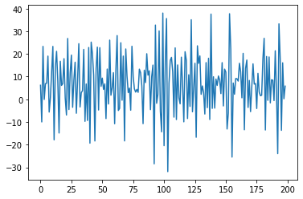
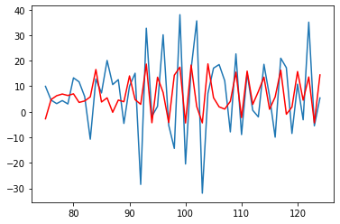

```python
import torch
import torch.nn as nn
import numpy as np
from scipy.io import wavfile
import matplotlib.pyplot as plt
```

***
### GATED RECURRENT UNITS IMPLEMENTATION FROM SCRATCH
***

### *DATA*


```python
num_data = 200;

x = torch.arange(0,num_data, dtype=torch.float32);

B_0, B_1 = 5, 7;

data = B_0 + B_1*x;
data += torch.distributions.normal.Normal(0,10).sample((num_data,));
```


```python
fig1, ax1 = plt.subplots();
ax1.plot(x, data);
```


    

    


```python
data_trans = data[1:] - data[:-1];
```


```python
fig_t, ax_t = plt.subplots();
ax_t.plot(x[0:num_data-1], data_trans);
```


    

    


***
### *DATA LOADER*


```python
def sequencesPreparation(input_data_1d, sequence_len):
    X,Y = [], [];
    
    for i in range(len(input_data_1d) - sequence_len):
        X.append(input_data_1d[i:i+sequence_len]);
        Y.append(input_data_1d[(i+1):(i+1)+sequence_len]);

    return torch.stack(X), torch.stack(Y);
```


```python
def XYdataLoader(input_data_1d, sequence_len, batch_size, shuffle):
    
    X,Y = sequencesPreparation(input_data_1d, sequence_len);

    dataset = torch.utils.data.TensorDataset(X,Y);
    
    return torch.utils.data.DataLoader(dataset, batch_size, shuffle=shuffle, num_workers=2);
```


```python
sequence_len = 19;
batch_size = (num_data-1)-sequence_len;

dataset = XYdataLoader(data_trans, sequence_len, batch_size, True);
dataset_approx = XYdataLoader(data_trans, sequence_len, batch_size, False);
```

***
### *MODEL*

Note : 

If **U** is Uniform [0,1], then **(r2 - r1) * U + r1** is Uniform [r1,r2].

In the GRU class, initialization of weight parameters is Uniform [-1,1].


```python
class GRU(nn.Module):
    def __init__(self, x_size, h_size, q_size):
        super().__init__();
        
        ## RESET GATE PARAMETERS 
        self.W_xr = nn.Parameter(2*torch.rand(x_size, h_size)-1);
        self.W_hr = nn.Parameter(2*torch.rand(h_size, h_size)-1);
        self.b_r = nn.Parameter(torch.zeros((1,h_size)));
        
        ## UPDATE GATE PARAMETERS 
        self.W_xz = nn.Parameter(2*torch.rand(x_size, h_size)-1);
        self.W_hz = nn.Parameter(2*torch.rand(h_size, h_size)-1);
        self.b_z = nn.Parameter(torch.zeros((1,h_size)));
        
        ## H_tilde PARAMETERS
        self.W_xh = nn.Parameter(2*torch.rand(x_size, h_size)-1);
        self.W_hh = nn.Parameter(2*torch.rand(h_size, h_size)-1);
        self.b_h = nn.Parameter(torch.zeros((1,h_size)));
        
        ## OUTPUT PARAMETERS
        self.W_hq = nn.Parameter(2*torch.rand(h_size, q_size)-1);
        self.b_q = nn.Parameter(torch.zeros((1,q_size)));

    def forward(self, X):
        outputs = [];
        H = None;
        
        for t in range(len(X)):
            
            S, T = nn.Sigmoid(), nn.Tanh();
            
            R_t = S(torch.matmul(X[t],self.W_xr) + 
                                (torch.matmul(H,self.W_hr) if H is not None else 0) + self.b_r);
            
            H = torch.zeros_like(R_t);
            
            Z_t = S(torch.matmul(X[t],self.W_xz) + torch.matmul(H,self.W_hz) + self.b_z);
            
            H_tilde = T(torch.matmul(X[t],self.W_xh) + torch.matmul((R_t * H),self.W_hh) + self.b_h);
            
            H = Z_t * H + (1-Z_t)*H_tilde;
            
            outputs.append(torch.matmul(H, self.W_hq) + self.b_q);
            
        return outputs;
```

***
### *LOSS*


```python
def loss(Y_hat, Y):
    
    Y_hat = torch.cat(Y_hat, dim=0);
    Y = Y.flatten().reshape(-1,1);
    
    return ((Y_hat-Y)**2).mean();
```

***
### *TRANSFORMATIONS*


```python
def XTransform(X):
    X = torch.transpose(X,0,1);
    X = X.reshape(X.shape[0], -1, 1);
    
    return X;
```


```python
def YTransform(Y):
    return torch.transpose(Y,0,1);
```

***
### *GRADIENT CLIPPING*

I use equation **(9.5.3)** defined in https://d2l.ai/chapter_recurrent-neural-networks/rnn-scratch.html#gradient-clipping and i define:    
**theta = alpha*torch.numel(param.grad)** where **alpha** is a hyperparameter.


```python
def gradientClipping(gru, alpha=1):
    for param in gru.parameters():
        if param.requires_grad:
            norm = torch.norm(param.grad.flatten());
            theta = alpha*param.numel();
            
            if norm > theta:
                param.grad *= theta/norm;
```

***
### *TRAINING*


```python
def trainGRU(gru, dataset, loss, optimizer, num_epochs, alpha=1):
    
    gru.train();
    
    for epoch in range(num_epochs):
        X_test, Y_test = None, None;

        for X,Y in dataset:
            X = XTransform(X);
            Y = YTransform(Y);            
            l = loss(gru(X), Y);

            with torch.no_grad():
                l.backward();
#                 gradientClipping(gru, alpha);
                optimizer.step();
                optimizer.zero_grad();

            if X_test == None and Y_test == None:
                X_test, Y_test = X, Y;
            
        print(f'Training loss {loss(gru(X_test), Y_test)}');
        print(f'Epoch {epoch}');                        
        
    return gru;
```


```python
gru = GRU(1, 16, 1);
```


```python
optimizer = torch.optim.SGD(gru.parameters(), lr=0.003);
```


```python
gru_trained = trainGRU(gru, dataset, loss, optimizer, 5000);
```

    Training loss 252.34649658203125
    Epoch 0
    Training loss 237.70933532714844
    Epoch 1
    Training loss 230.74887084960938
    Epoch 2
    Training loss 226.0172576904297
    Epoch 3
    ...
    Training loss 136.90711975097656
    Epoch 4996
    Training loss 136.98568725585938
    Epoch 4997
    Training loss 136.9063720703125
    Epoch 4998
    Training loss 136.9849853515625
    Epoch 4999


***
### *APPROXIMATION OF THE DATA OF THE GRU*


```python
def GRUapproximation(gru, dataset):
    
    gru.eval();
    with torch.no_grad():
        Y_hat = None;

        for X,Y in dataset:
            X = XTransform(X);
            Y_hat_batch = gru(X);

            if Y_hat == None:
                Y_hat = Y_hat_batch[-1];
            else:
                Y_hat = torch.cat([Y_hat, Y_hat_batch[-1]], dim=0);
        
    return Y_hat;
```


```python
Y_hat = GRUapproximation(gru, dataset_approx);
Y_hat = Y_hat.flatten();
Y_hat.shape
```


    torch.Size([180])


```python
fig2, ax2 = plt.subplots();
ax2.plot(x[0:num_data-1], data_trans);
ax2.plot(torch.arange(sequence_len,num_data-1), Y_hat.detach().numpy(), color="r");
```


    

    


```python
fig_zoom, ax_zoom = plt.subplots();
ax_zoom.plot(x[75:125], data_trans[75:125]);
ax_zoom.plot(torch.arange(75,125), Y_hat.detach().numpy()[75-sequence_len:125-sequence_len], color="r");
```


    

    


```python
data_approx = Y_hat + data[sequence_len:-1];

fig3, ax3 = plt.subplots();
ax3.plot(x, data);
ax3.plot(torch.arange(sequence_len,num_data-1), data_approx.detach().numpy(), color="r");
```


    

    

