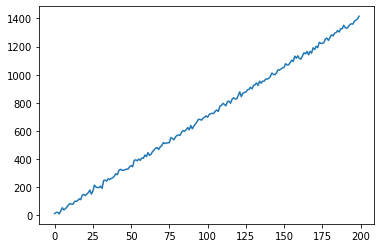
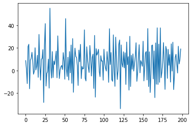
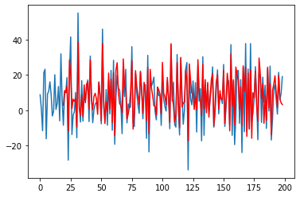
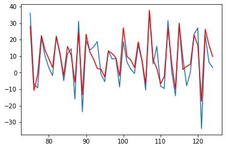
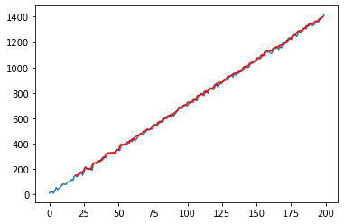
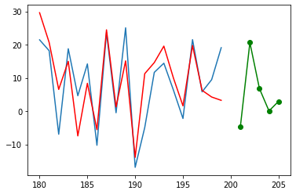

```python
import torch
import torch.nn as nn
import numpy as np
from scipy.io import wavfile
import matplotlib.pyplot as plt
```

***
### LONG SHORT TERM MEMORY IMPLEMENTATION FROM SCRATCH
***

### *DATA*


```python
num_data = 200;

x = torch.arange(0,num_data, dtype=torch.float32);

B_0, B_1 = 5, 7;

data = B_0 + B_1*x;
data += torch.distributions.normal.Normal(0,10).sample((num_data,));
```


```python
fig1, ax1 = plt.subplots();
ax1.plot(x, data);
```


    

    


```python
data_trans = data[1:] - data[:-1];
```


```python
fig_t, ax_t = plt.subplots();
ax_t.plot(x[0:num_data-1], data_trans);
```


    

    


***
### *DATA LOADER*


```python
def sequencesPreparation(input_data_1d, sequence_len):
    X,Y = [], [];
    
    for i in range(len(input_data_1d) - sequence_len):
        X.append(input_data_1d[i:i+sequence_len]);
        Y.append(input_data_1d[(i+1):(i+1)+sequence_len]);

    return torch.stack(X), torch.stack(Y);
```


```python
def XYdataLoader(input_data_1d, sequence_len, batch_size, shuffle):
    
    X,Y = sequencesPreparation(input_data_1d, sequence_len);

    dataset = torch.utils.data.TensorDataset(X,Y);
    
    return torch.utils.data.DataLoader(dataset, batch_size, shuffle=shuffle, num_workers=2);
```


```python
sequence_len = 19;
batch_size = (num_data-1)-sequence_len;

dataset = XYdataLoader(data_trans, sequence_len, batch_size, True);
dataset_approx = XYdataLoader(data_trans, sequence_len, batch_size, False);
```

***
### *MODEL*

Note : 

If **U** is Uniform [0,1], then **(r2 - r1) * U + r1** is Uniform [r1,r2].

In the LSTM class, initialization of weight parameters is Uniform [-1,1].


```python
class LSTM(nn.Module):
    def __init__(self, x_size, h_size, q_size):
        super().__init__();
        
        ## INPUT GATE PARAMETERS 
        self.W_xi = nn.Parameter(2*torch.rand(x_size, h_size)-1);
        self.W_hi = nn.Parameter(2*torch.rand(h_size, h_size)-1);
        self.b_i = nn.Parameter(torch.zeros((1,h_size)));
        
        ## FORGET GATE PARAMETERS 
        self.W_xf = nn.Parameter(2*torch.rand(x_size, h_size)-1);
        self.W_hf = nn.Parameter(2*torch.rand(h_size, h_size)-1);
        self.b_f = nn.Parameter(torch.zeros((1,h_size)));
        
        ## OUTPUT GATE PARAMETERS 
        self.W_xo = nn.Parameter(2*torch.rand(x_size, h_size)-1);
        self.W_ho = nn.Parameter(2*torch.rand(h_size, h_size)-1);
        self.b_o = nn.Parameter(torch.zeros((1,h_size)));
        
        ## C_tilde PARAMETERS
        self.W_xc = nn.Parameter(2*torch.rand(x_size, h_size)-1);
        self.W_hc = nn.Parameter(2*torch.rand(h_size, h_size)-1);
        self.b_c = nn.Parameter(torch.zeros((1,h_size)));
        
        ## OUTPUT PARAMETERS
        self.W_hq = nn.Parameter(2*torch.rand(h_size, q_size)-1);
        self.b_q = nn.Parameter(torch.zeros((1,q_size)));

    def forward(self, X):
        outputs = [];
        H, C = None, None;
        
        ## A always refers to the inputs (X,H).
        ## B always refers to the parameters (W).
        matmul = lambda A,B: torch.matmul(A,B) if A is not None else 0;
        
        for t in range(len(X)):
            S, T = nn.Sigmoid(), nn.Tanh();
            
            I_t = S(matmul(X[t],self.W_xi) + matmul(H,self.W_hi) + self.b_i);
            F_t = S(matmul(X[t],self.W_xf) + matmul(H,self.W_hf) + self.b_f);
            O_t = S(matmul(X[t],self.W_xo) + matmul(H,self.W_ho) + self.b_o);
            
            C_tilde = T(matmul(X[t],self.W_xc) + matmul(H,self.W_hc) + self.b_c);
            C = (F_t*C if C is not None else 0) + I_t*C_tilde;
            
            H = O_t*T(C);
            
            outputs.append(matmul(H, self.W_hq) + self.b_q);
            
        return outputs;
```

***
### *LOSS*


```python
def loss(Y_hat, Y):
    
    Y_hat = torch.cat(Y_hat, dim=0);
    Y = Y.flatten().reshape(-1,1);
    
    return ((Y_hat-Y)**2).mean();
```

***
### *TRANSFORMATIONS*


```python
def XTransform(X):
    X = torch.transpose(X,0,1);
    X = X.reshape(X.shape[0], -1, 1);
    
    return X;
```


```python
def YTransform(Y):
    return torch.transpose(Y,0,1);
```

***
### *GRADIENT CLIPPING*

I use equation **(9.5.3)** defined in https://d2l.ai/chapter_recurrent-neural-networks/rnn-scratch.html#gradient-clipping and i define:    
**theta = alpha*torch.numel(param.grad)** where **alpha** is a hyperparameter.


```python
def gradientClipping(lstm, alpha=1):
    for param in lstm.parameters():
        if param.requires_grad:
            norm = torch.norm(param.grad.flatten());
            theta = alpha*param.numel();
            
            if norm > theta:
                param.grad *= theta/norm;
```

***
### *TRAINING*


```python
def trainLSTM(lstm, dataset, loss, optimizer, num_epochs, alpha=1):
    
    lstm.train();
    
    for epoch in range(num_epochs):
        X_test, Y_test = None, None;

        for X,Y in dataset:
            X = XTransform(X);
            Y = YTransform(Y);            
            l = loss(lstm(X), Y);

            with torch.no_grad():
                l.backward();
#                 gradientClipping(lstm, alpha);
                optimizer.step();
                optimizer.zero_grad();

            if X_test == None and Y_test == None:
                X_test, Y_test = X, Y;
            
        print(f'Training loss {loss(lstm(X_test), Y_test)}');
        print(f'Epoch {epoch}');                        
        
    return lstm;
```


```python
lstm = LSTM(1, 16, 1);
```


```python
optimizer = torch.optim.SGD(lstm.parameters(), lr=0.003);
```


```python
lstm_trained = trainLSTM(lstm, dataset, loss, optimizer, 5000);
```

    Training loss 276.6614685058594
    Epoch 0
    Training loss 274.4438781738281
    Epoch 1
    Training loss 272.2842102050781
    Epoch 2
    Training loss 269.8257141113281
    Epoch 3
    ...
    Training loss 83.03297424316406
    Epoch 4996
    Training loss 78.37651062011719
    Epoch 4997
    Training loss 81.0925064086914
    Epoch 4998
    Training loss 79.07604217529297
    Epoch 4999


***
### *APPROXIMATION OF THE DATA OF THE LSTM*


```python
def LSTMapproximation(lstm, dataset):
    
    lstm.eval();
    with torch.no_grad():
        Y_hat = None;

        for X,Y in dataset:
            X = XTransform(X);
            Y_hat_batch = lstm(X);

            if Y_hat == None:
                Y_hat = Y_hat_batch[-1];
            else:
                Y_hat = torch.cat([Y_hat, Y_hat_batch[-1]], dim=0);
        
    return Y_hat;
```


```python
Y_hat = LSTMapproximation(lstm, dataset_approx);
Y_hat = Y_hat.flatten();
Y_hat.shape
```


    torch.Size([180])


```python
fig2, ax2 = plt.subplots();
ax2.plot(x[0:num_data-1], data_trans);
ax2.plot(torch.arange(sequence_len,num_data-1), Y_hat.detach().numpy(), color="r");
```


    

    


```python
fig_zoom, ax_zoom = plt.subplots();
ax_zoom.plot(x[75:125], data_trans[75:125]);
ax_zoom.plot(torch.arange(75,125), Y_hat.detach().numpy()[75-sequence_len:125-sequence_len], color="r");
```


    

    


```python
data_approx = Y_hat + data[sequence_len:-1];

fig3, ax3 = plt.subplots();
ax3.plot(x, data);
ax3.plot(torch.arange(sequence_len,num_data-1), data_approx.detach().numpy(), color="r");
```


    

    


***
### *EXTRAPOLATION OF LSTM*


```python
def extrapolation(lstm, initial_sequence, num_extra_points):
    
    seq = initial_sequence;
    preds = [];
    
    lstm.eval();
    with torch.no_grad():    
        for p in range(num_extra_points):
            outputs = lstm(seq);
            
            pred = torch.squeeze(outputs[-1]);
            preds.append(pred);
            
            seq = torch.cat((seq, torch.tensor([[[pred]]])));
            seq = seq[1:];
    
    return preds;
```


```python
init_seq = data_trans[-sequence_len:];
init_seq = init_seq[None,:];
init_seq = XTransform(init_seq);
```


```python
num_extra_points = 5;
extra_preds = extrapolation(lstm, init_seq, num_extra_points);
```


```python
fig_extra, ax_extra = plt.subplots();
ax_extra.plot(x[-20:], data_trans[-20:]);
ax_extra.plot(torch.arange(num_data-20,num_data), Y_hat.detach().numpy()[-20:], color="r");
ax_extra.plot(torch.arange(num_data+1,num_data+1+num_extra_points), extra_preds, color="g", marker="o");
```


    

    

