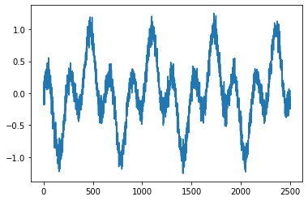
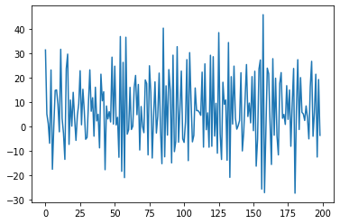

```python
import torch
import torch.nn as nn
import numpy as np
from scipy.io import wavfile
import matplotlib.pyplot as plt
```

***
### SIMPLE RECURRENT NEURAL NETWORK IMPLEMENTATION FROM SCRATCH
***

### *DATA*


```python
x = torch.arange(0,2500);
data = torch.cos(x * 0.02) * torch.sin(x * 0.01);
data += torch.distributions.normal.Normal(0,0.1).sample((2500,));
```


```python
fig1, ax1 = plt.subplots();
ax1.plot(x, data);
```


    

    


***
### *DATA LOADER*


```python
def sequencesPreparation(input_data_1d, sequence_len):
    X,Y = [], [];
    
    for i in range(len(input_data_1d) - sequence_len):
        X.append(input_data_1d[i:i+sequence_len]);
        Y.append(input_data_1d[(i+1):(i+1)+sequence_len]);

    return torch.stack(X), torch.stack(Y);
```


```python
def XYdataLoader(input_data_1d, sequence_len, batch_size):
    
    X,Y = sequencesPreparation(input_data_1d, sequence_len);

    dataset = torch.utils.data.TensorDataset(X,Y);
    
    return torch.utils.data.DataLoader(dataset, batch_size, shuffle=True, num_workers=2);
```


```python
batch_size = 100;
sequence_len = 600;

dataset = XYdataLoader(data, sequence_len, batch_size);
```

***
### *MODEL*

Note : 

If **U** is Uniform [0,1], then **(r2 - r1) * U + r1** is Uniform [r1,r2].

In the RNN class, initialization of weight parameters is Uniform [-1,1].


```python
class RNN(nn.Module):
    def __init__(self, x_size, h_size, q_size):
        super().__init__();
            
        self.W_xh = nn.Parameter(2*torch.rand(x_size, h_size)-1);
        self.W_hh = nn.Parameter(2*torch.rand(h_size, h_size)-1);
        self.b_h = nn.Parameter(torch.zeros(h_size));
        
        self.W_hq = nn.Parameter(2*torch.rand(h_size, q_size)-1);
        self.b_q = nn.Parameter(torch.zeros(q_size));

    def forward(self, X):

        outputs = [];
        
        for t in range(len(X)):
            if t == 0:
                H_t = torch.tanh(X[t] * self.W_xh + self.b_h);
            else:
                H_t = torch.tanh(X[t] * self.W_xh + torch.matmul(H_t, self.W_hh) + self.b_h);

            outputs.append(torch.matmul(H_t, self.W_hq) + self.b_q);
            
        return outputs;
```

***
### *LOSS*


```python
def loss(Y_hat, Y):
    
    Y_hat = torch.cat(Y_hat, dim=0);
    Y = Y.flatten().reshape(-1,1);
    
    return ((Y_hat-Y)**2).mean();
```

***
### *TRANSFORMATIONS*


```python
def XTransform(X):
    X = torch.transpose(X,0,1);
    X = X.reshape(X.shape[0], -1, 1);
    
    return X;
```


```python
def YTransform(Y):
    return torch.transpose(Y,0,1);
```

***
### *GRADIENT CLIPPING*

I use equation **(9.5.3)** defined in https://d2l.ai/chapter_recurrent-neural-networks/rnn-scratch.html#gradient-clipping and i define:    
**theta = alpha*torch.numel(param.grad)** where **alpha** is a hyperparameter.


```python
def gradientClipping(rnn, alpha=1):
    for param in rnn.parameters():
        if param.requires_grad:
            norm = torch.norm(param.grad.flatten());
            theta = alpha*param.numel();
            
            if norm > theta:
                param.grad *= theta/norm;
```

***
### *TRAINING*


```python
def trainRNN(rnn, dataset, loss, optimizer, num_epochs, batch_size, alpha=1):
    
    rnn.train();
    
    for epoch in range(num_epochs):
        X_test, Y_test = None, None;

        for X,Y in dataset:
                
            if len(X) == batch_size:
                X = XTransform(X);
                Y = YTransform(Y);            
                l = loss(rnn(X), Y);
                
                with torch.no_grad():
                    l.backward();
                    gradientClipping(rnn, alpha);
                    optimizer.step();
                    optimizer.zero_grad();
                    
                if X_test == None and Y_test == None:
                    X_test, Y_test = X, Y;
            
        print(f'Training loss {loss(rnn(X_test), Y_test)}');
        print(f'Epoch {epoch}');                        
        
    return rnn;
```


```python
rnn = RNN(batch_size, 8, 1);
optimizer = torch.optim.SGD(rnn.parameters(), lr=0.03);
```


```python
rnn_trained = trainRNN(rnn, dataset, loss, optimizer, 250, batch_size);
```

    Training loss 0.45660316944122314
    Epoch 0
    Training loss 0.3369460999965668
    Epoch 1
    Training loss 0.3097529113292694
    Epoch 2
    ...
    Training loss 0.22583262622356415
    Epoch 247
    Training loss 0.2208634614944458
    Epoch 248
    Training loss 0.2216733694076538
    Epoch 249


***
### *APPROXIMATION OF THE DATA OF THE RNN*


```python
def RNNapproximation(rnn, dataset, batch_size):
    
    Y_hat = None;

    for X,Y in dataset:
        if len(X) == batch_size:
            X = XTransform(X);
            Y_hat_batch = rnn(X);

            if Y_hat == None:
                Y_hat = Y_hat_batch[-1];
            else:
                Y_hat = torch.cat([Y_hat, Y_hat_batch[-1]], dim=0);
        
    return Y_hat;
```


```python
Y_hat = RNNapproximation(rnn, dataset, batch_size);
Y_hat = Y_hat.flatten();
Y_hat.shape
```


    torch.Size([1900])


```python
fig2, ax2 = plt.subplots();
ax2.plot(x[sequence_len:2500], data[sequence_len:2500]);
ax2.plot(torch.arange(sequence_len,2500), Y_hat.detach().numpy(), color="r");
```


    

    

